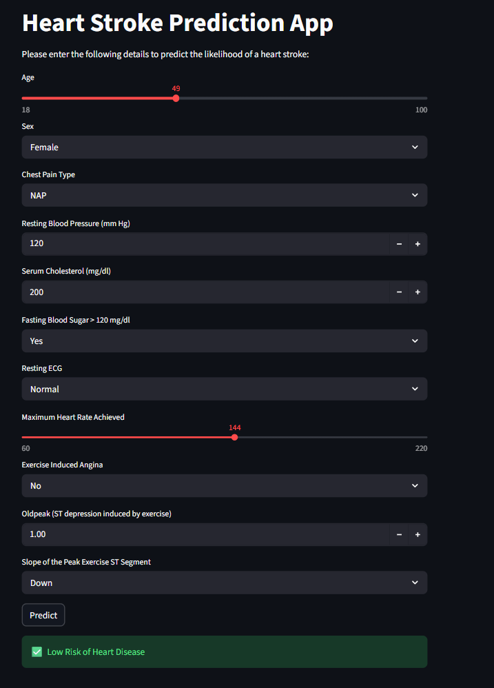
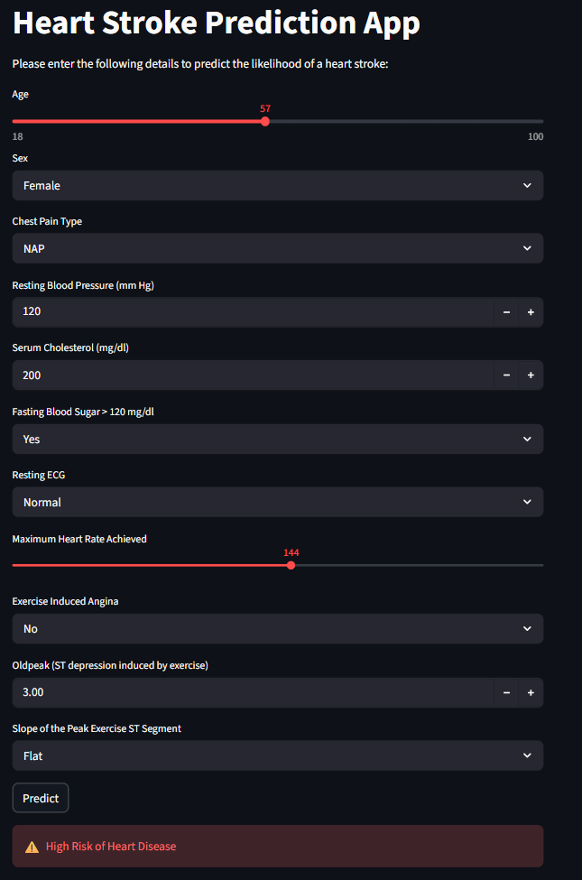

# heart_prediction
A Streamlit web application that predicts the likelihood of heart disease/stroke using a trained machine learning model.   This project demonstrates end-to-end ML deployment: training, saving models, building a UI, and deploying with Streamlit.

Working link : https://heartprediction-ptawkd92khxsjirumcbq4v.streamlit.app/

## 🚀 Features
- Interactive UI built with **Streamlit**
- Predicts risk based on user inputs (age, cholesterol, BP, etc.)
- Uses a trained **scikit-learn model** with preprocessing (scaler + one-hot encoding)
- Displays results with clear risk indicators (✅ Low Risk / ⚠️ High Risk)

---

## 📂 Project Structure
heart_disease/
│
├── app.py                # Streamlit app (main UI + prediction logic)
├── model.pkl             # Trained ML model
├── scaler.pkl            # Scaler used during training
├── columns.pkl           # Expected feature columns
├── requirements.txt      # Dependencies
├── README.md             # Project documentation

## 📸 Screenshots

1. **Prediction Example (Low Risk)**  
   

2. **Prediction Example (High Risk)**  
   

---

## ⚙️ Installation

Clone the repository:

git clone https://github.com/<your-username>/heart-stroke-prediction.git
cd heart-stroke-prediction
Create a virtual environment:

bash
python -m venv .venv
source .venv/bin/activate   # On Linux/Mac
.venv\Scripts\activate      # On Windows
Install dependencies:

pip install -r requirements.txt
▶️ Run the App

streamlit run app.py
Open your browser at http://localhost:8501.

📦 Requirements
Add these to requirements.txt:

streamlit
pandas
scikit-learn
joblib
plotly

🧑‍💻 Author
Your Name

GitHub: @arunimasharma33 (github.com in Bing)

